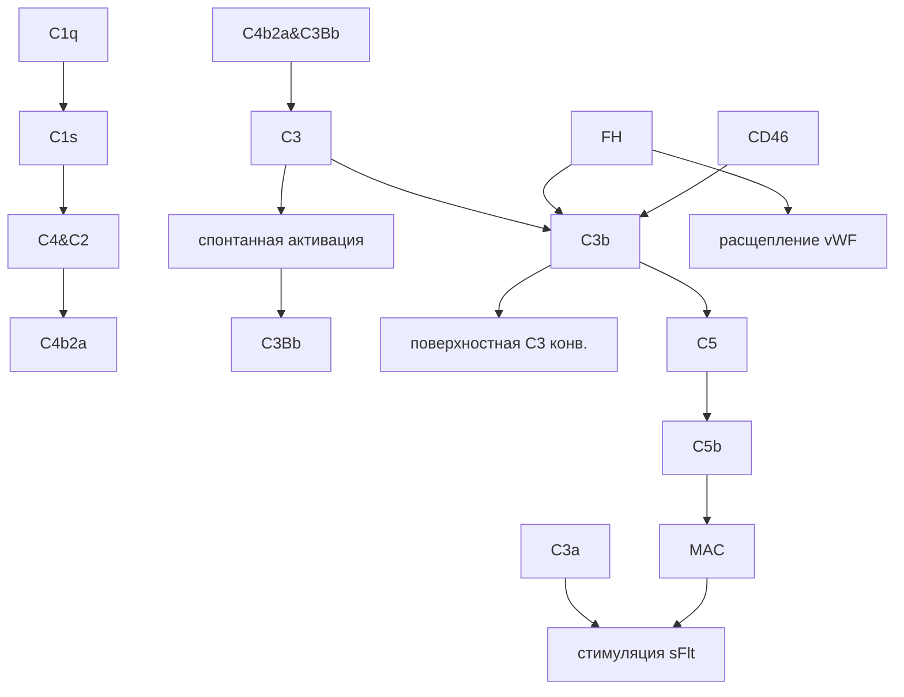

```mermaid
graph TD
C1q-->C1s-->C4&C2-->C4b2a
C3-->C3H2O["спонтанная активация"]-->C3Bb
C4b2a&C3Bb-->C3-->C3b
C3b-->C3bBb["поверхностная С3 конв."]
C3b-->C5-->C5b-->MAC
FH-->C3b;FH-->vWF[расщепление vWF]
CD46-->C3b
C3a-->sFlt[стимуляция sFlt]
MAC-->sFlt
```
